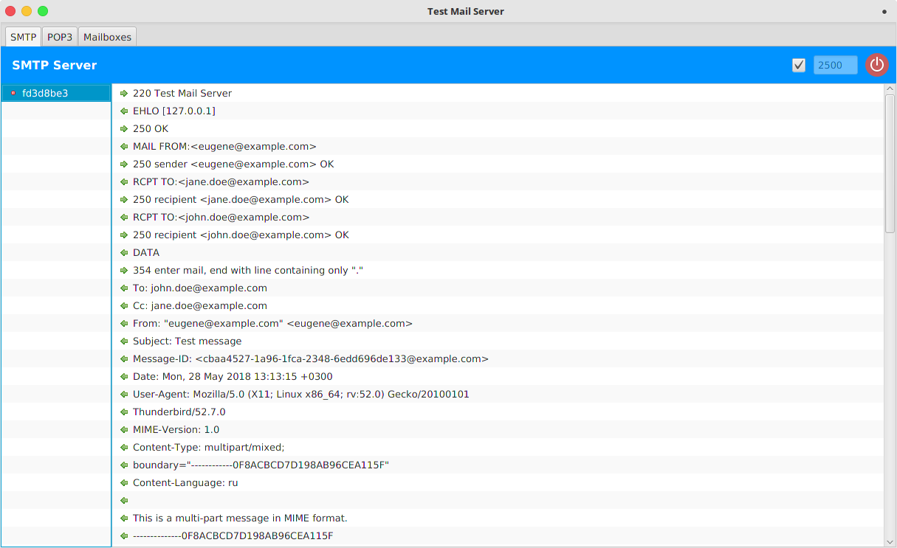
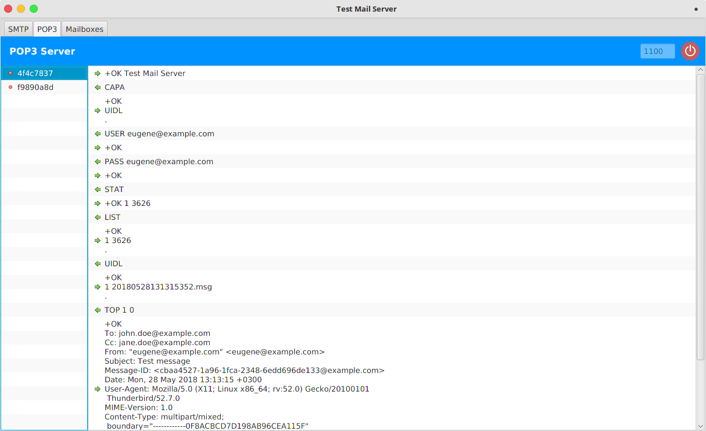
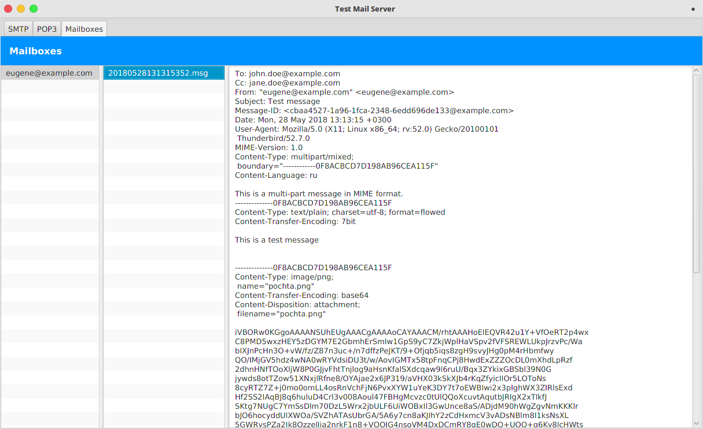

# dev-mailserver

A modern, lightweight mail server for development and testing purposes – now restructured and updated for Java 17 and beyond.

This project is based on the original [test-mail-server](https://github.com/eugenehr/test-mail-server) by Eugene Khrustalev, but has been restructured and rebooted with a focus on modern tooling, maintainability, and extensibility. The first commit is the original version.

It is not intended to use it somehow in production, only for testing purpose.

---

## ✨ Goals

- **Java 17 migration** with up-to-date dependencies
- Designed for test environments, integration testing, and developer workflows

---

## 🔧 Tech Stack

- Java 17+
- Maven
- CI/CD via GitHub Actions

---

## 📦 Project Status

This repository currently contains the final state of the original project (single commit), serving as the base for further modernization and improvements.

---

## 📝 License

This project is licensed under the [Apache License 2.0](LICENSE).

> This project is derived from the original work of [Eugene Khrustalev](https://github.com/eugenehr/test-mail-server).  
> All original license and copyright notices are retained.

# dev-mailserver

A SMTP/POP3 server for testing purposes purely written on Java&trade; with the [Netty](https://netty.io) framework. 

### Usage

The **dev-mailserver-&lt;version&gt;.jar** is auto-executable.
If your desktop environment supports it, you can directly double click on the .jar. 
Otherwise, run the following command with the next command-line arguments.

```
java -jar dev-mailserver-<version>.jar <args>
```

### Command-line arguments

Argument                              | Description
--------------------------------------|------------
-h, --help                            | Show help
-s, --smtp-port **&lt;port&gt;**      | Start the SMTP server on the given port
-sr, --smtp-redirect                  | Redirect all incoming messages to the sender's mailbox
-p, --pop3-port **&lt;port&gt;**      | Start the POP3 server on the given port
-m, --mail-dir **&lt;directory&gt;**  | Path to directory to store user's mailboxes and mail messages
-c, --console                         | Start the application in the console mode. No GUI. Can be used to start the application as a *nix daemon or a Windows Service
        

### SMTP server tab


Shows a list of SMTP transactions and its details.


### POP3 server tab


Shows a list of POP3 transactions and its details.


### Mailboxes tab


Shows a list of user's mailboxes, messages in mailboxes and message's bodies.

